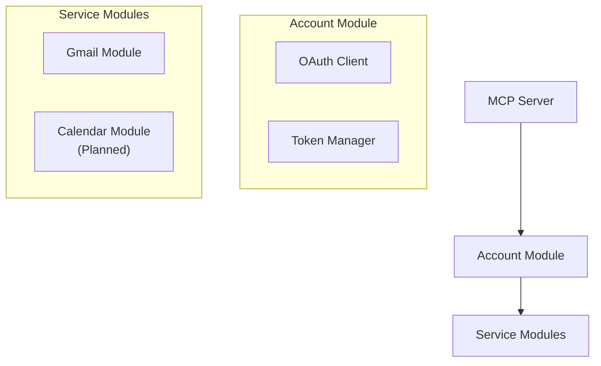
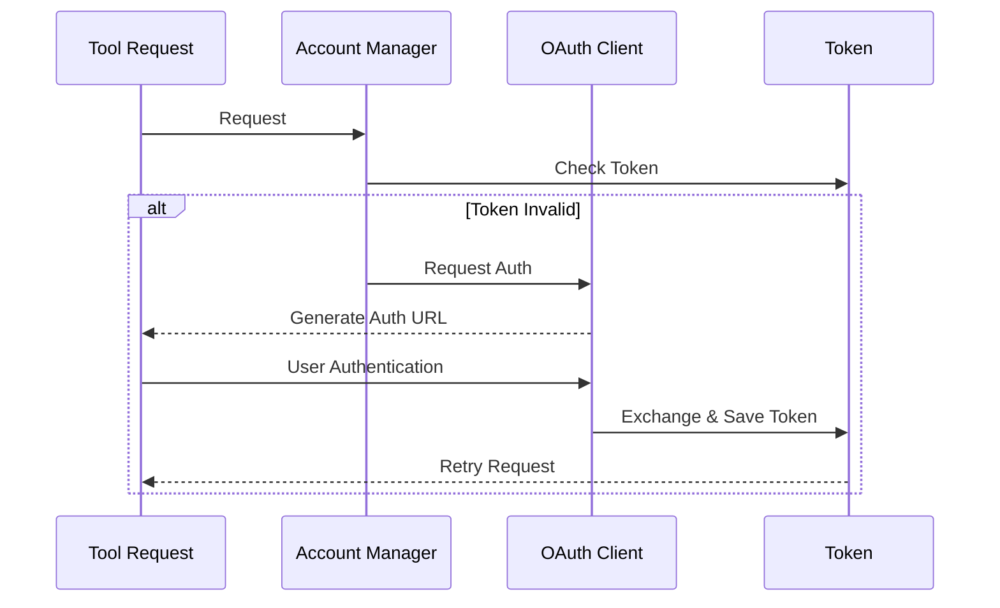
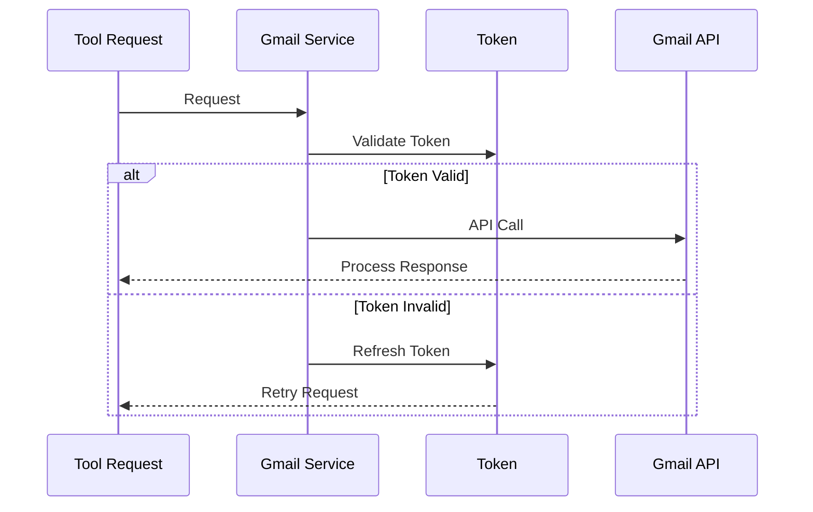

# Architecture

## System Overview

The Google Services MCP Server implements a modular architecture focused on Gmail functionality with planned expansion to other Google services. The system is built around core modules that handle authentication, account management, and service-specific operations.



## Core Components (Current Implementation)

### 1. MCP Server (src/index.ts)
- Registers and manages available tools
- Handles request routing and validation
- Provides consistent error handling
- Manages server lifecycle

### 2. Account Module (src/modules/accounts/*)
- OAuth Client:
  - Implements Google OAuth 2.0 flow
  - Handles token exchange and refresh
  - Provides authentication URLs
  - Manages client credentials
- Token Manager:
  - Handles token lifecycle
  - Validates and refreshes tokens
  - Manages token storage
- Account Manager:
  - Manages account configurations
  - Handles account persistence
  - Validates account status

### 3. Gmail Module (src/modules/gmail/*)
- Implements email operations:
  - List and fetch emails
  - Send emails
  - Handle Gmail-specific errors
- Manages Gmail API integration
- Handles Gmail authentication scopes

## Data Flows

### Authentication Flow


### Gmail Operation Flow


## Implementation Details

### Security
- OAuth 2.0 implementation with offline access
- Secure token storage and management
- Scope-based access control
- Environment-based configuration
- Secure credential handling

### Error Handling
- Detailed error messages with resolution steps
- Service-specific error types
- Automatic token refresh handling
- Clear authentication error guidance

### Configuration
- Environment-based file paths
- Separate credential storage
- Account configuration management
- Token persistence handling

## Project Structure
```
src/
├── index.ts                 # MCP server implementation
├── modules/
│   ├── accounts/           # Account & auth handling
│   │   ├── index.ts       # Module entry point
│   │   ├── manager.ts     # Account management
│   │   ├── oauth.ts       # OAuth implementation
│   │   └── token.ts       # Token handling
│   └── gmail/             # Gmail implementation
│       ├── index.ts       # Module entry point
│       ├── service.ts     # Gmail operations
│       └── types.ts       # Gmail types
└── scripts/
    └── setup-google-env.ts # Setup utilities

config/
├── gauth.json              # OAuth credentials
├── accounts.json           # Account configs
└── credentials/            # Token storage
```

## Configuration

### Environment Variables
```
AUTH_CONFIG_FILE  - OAuth credentials path
ACCOUNTS_FILE     - Account config path
CREDENTIALS_DIR   - Token storage path
```

### Required Files
1. OAuth Config (gauth.json):
```json
{
  "client_id": "...",
  "client_secret": "...",
  "redirect_uri": "..."
}
```

2. Account Config (accounts.json):
```json
{
  "accounts": [{
    "email": "user@example.com",
    "category": "work",
    "description": "Work Account"
  }]
}
```

## Planned Extensions

### Calendar Module (In Development)
- Event management
- Calendar operations
- Meeting scheduling
- Availability checking

### Future Services
- Drive API integration
- Admin SDK support
- Additional Google services

### Planned Features
- Rate limiting
- Response caching
- Request logging
- Performance monitoring
- Multi-account optimization
