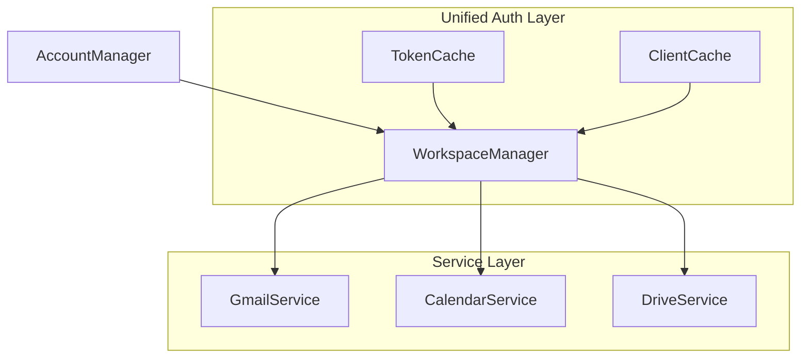
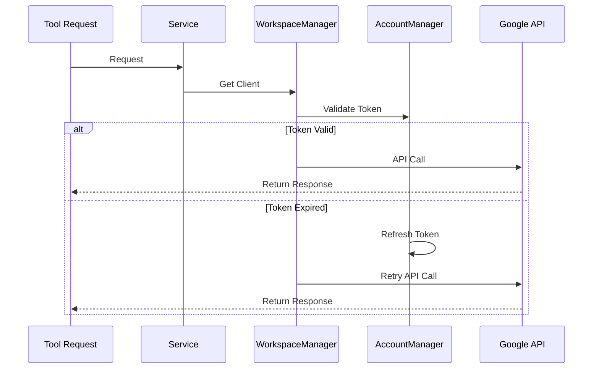

# TODO

## Current Implementation Status

### Gmail Module (Implemented)
- [x] Basic email operations
  - [x] List/get messages
  - [x] Send emails
  - [x] Advanced search
- [x] Advanced features
  - [x] Get user information and settings
  - [x] Advanced search capabilities
    - [x] Search by unread status
    - [x] Search by sender/recipient
    - [x] Search by date range
    - [x] Search for emails with attachments
    - [x] Search by labels
    - [x] Search in spam/trash
  - [x] Email content management
    - [x] Enhanced getEmails with batch fetching
    - [x] CC/BCC support
  - [x] Draft operations
    - [x] create_workspace_draft: Create drafts with full recipient options
    - [x] get_workspace_drafts: List available drafts
    - [x] send_workspace_draft: Send existing drafts
  - [x] Reply management
    - [x] Threading support
    - [x] Reply-to handling
    - [x] Message references
  - [ ] Attachment handling
    - [ ] Upload attachments
    - [ ] Download attachments
    - [ ] MIME type support

### Calendar Module (Implemented)
- [x] Core functionality
  - [x] List calendar events
  - [x] Get single events
  - [x] Create events
  - [x] Timezone support
- [ ] Advanced features
  - [ ] Recurring events
  - [x] Attendee management
  - [ ] Calendar sharing
  - [ ] Free/busy queries

## High Priority

### Authentication & Security
- [x] OAuth 2.0 implementation
- [x] Token refresh handling
- [x] Multi-account support
- [x] Account categorization
- [ ] Token encryption at rest
- [ ] Rate limiting
- [x] Unified Token/Auth System
  - [x] Create WorkspaceManager for centralized auth
  - [x] Implement token and client caching
  - [x] Update BaseGoogleService to use WorkspaceManager
  - [x] Migrate Gmail, Calendar, and Drive services
  - [ ] Add comprehensive auth tests

### Error Handling
- [x] Service-specific errors
- [x] Resolution guidance
- [x] Logging system
- [ ] Retry mechanisms
- [ ] Circuit breakers

## Medium Priority

### Performance
- [ ] Response caching
- [ ] Batch operations
- [ ] Connection pooling

### Developer Experience
- [x] Basic documentation
- [x] TypeScript support
- [x] Jest testing setup
- [ ] Integration tests
- [ ] Example projects

## Future Considerations

### Additional Services
- [ ] Drive API
- [ ] Admin SDK
- [ ] Sheets API
- [ ] Docs API

### Infrastructure
- [x] NPM scripts
- [ ] Docker support
- [ ] CI/CD pipeline
- [ ] Monitoring

### Documentation
- [x] API documentation
- [x] Error documentation
- [ ] Advanced guides
- [ ] Security hardening

## Unified Auth Implementation Plan

### Overview
The unified auth system will provide centralized token management and authentication for all Google Workspace services (Gmail, Calendar, Drive) through a single OAuth flow.

### Implementation Phases

#### Phase 1: Core Infrastructure
- Create WorkspaceManager class
  - Singleton pattern
  - Shared OAuth client
  - Token caching
  - Client caching
  - Global initialization

#### Phase 2: Service Integration
- Modify BaseGoogleService
  - Remove individual token management
  - Use WorkspaceManager for client acquisition
  - Simplify error handling
- Update service implementations
  - Gmail service
  - Calendar service
  - Drive service

#### Phase 3: Handler Updates
- Refactor handlers to use WorkspaceManager
  - Gmail handlers
  - Calendar handlers
  - Drive handlers
- Update error handling
  - Centralized auth errors
  - Consistent retry logic
  - Clear error boundaries

#### Phase 4: Testing & Validation
- Unit tests for WorkspaceManager
- Integration tests
- Auth flow validation
- Error scenario testing

### Data Flow

### Benefits
1. Single Source of Truth
   - One place for token management
   - Shared client instances
   - Consistent auth state

2. Improved Performance
   - Reduced token validations
   - Client reuse
   - Optimized refresh handling

3. Better Maintainability
   - Reduced code duplication
   - Clear responsibility separation
   - Easier debugging
