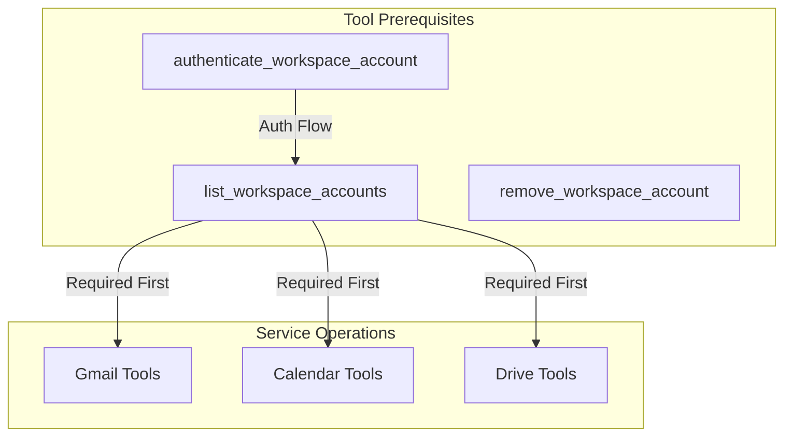

# Tool Discovery and Aliases

The Google Workspace MCP server provides several features to make tools more discoverable and easier to use:

## Tool Categories

Tools are organized into logical categories for better organization. IMPORTANT: The list_workspace_accounts tool must be called before using any other tools to verify account access and authorization.

- Account Management
  - Authentication and account management tools
  - Core tools for account lifecycle management
  - Required for all other operations

- Gmail Management
  - Messages
    - Email search and composition
    - Email settings and configuration
  - Drafts
    - Draft email creation and management
    - Reply drafts and threading
  - Labels
    - Label creation and management
    - Label filter creation and rules
    - Message label assignments
  - Settings
    - Account settings and preferences
    - Profile configuration

- Calendar Management
  - Events
    - Event listing and search
    - Event creation and management
    - Event responses and updates
    - Recurring event support
    - Calendar viewing and scheduling

- Drive Management
  - Files
    - File listing and search
    - Upload and download operations
    - File content management
  - Folders
    - Folder creation and organization
    - Directory structure management
  - Permissions
    - Sharing settings management
    - Access control and visibility
    - Collaboration settings

## Tool Dependencies



### Critical Workflows

1. Account Verification (Required First)
```javascript
// Always start with account verification
list_workspace_accounts()
// Then proceed with service-specific operations
```

2. Authentication Flow
```javascript
// Only if list_workspace_accounts shows no valid account
authenticate_workspace_account({
  email: "user@example.com"
})
// Wait for user to complete OAuth
// Then proceed with operations
```

3. Service Operations
```javascript
// After account verification:
// Gmail operations
search_workspace_emails({...})
send_workspace_email({...})

// Calendar operations
list_workspace_calendar_events({...})
create_workspace_calendar_event({...})

// Drive operations
list_drive_files({...})
upload_drive_file({...})
```

## Tool Aliases

Most tools support multiple aliases for more intuitive usage. For example:

```javascript
// All of these are equivalent:
create_workspace_label
create_label
new_label
create_gmail_label
```

## Improved Error Messages

When a tool name is not found, the server provides helpful suggestions:

```
Tool 'create_gmail_lable' not found.

Did you mean:
- create_workspace_label (Gmail/Labels)
  Aliases: create_label, new_label, create_gmail_label

Available categories:
- Gmail/Labels: create_label, update_label, delete_label
- Gmail/Messages: send_email, search_emails
- Calendar/Events: create_event, update_event, delete_event
```

## Tool Metadata

Each tool includes:

- Category: Logical grouping for organization
- Aliases: Alternative names for the tool
- Description: Detailed usage information
- Input Schema: Required and optional parameters

## Best Practices

1. Use the most specific tool name when possible
2. Check error messages for similar tool suggestions
3. Use the list_workspace_tools command to see all available tools
4. Refer to tool categories for related functionality

## Examples

### Creating a Label

```javascript
// Any of these work:
create_workspace_label({
  email: "user@example.com",
  name: "Important/Projects",
  messageListVisibility: "show",
  labelListVisibility: "labelShow",
  color: {
    textColor: "#000000",
    backgroundColor: "#E7E7E7"
  }
})

create_label({
  email: "user@example.com",
  name: "Important/Projects"
})
```

### Creating a Label Filter

```javascript
// Create a filter to automatically label incoming emails
create_workspace_label_filter({
  email: "user@example.com",
  labelId: "Label_123",
  criteria: {
    from: ["team@company.com"],
    subject: "Project Update",
    hasAttachment: true
  },
  actions: {
    addLabel: true,
    markImportant: true
  }
})
```

### Managing Message Labels

```javascript
// Add/remove labels from a message
modify_workspace_message_labels({
  email: "user@example.com",
  messageId: "msg_123",
  addLabelIds: ["Label_123"],
  removeLabelIds: ["UNREAD"]
})
```

### Sending an Email

```javascript
// These are equivalent:
send_workspace_email({
  email: "user@example.com",
  to: ["recipient@example.com"],
  subject: "Hello",
  body: "Message content",
  cc: ["cc@example.com"]
})

send_email({
  email: "user@example.com",
  to: ["recipient@example.com"],
  subject: "Hello",
  body: "Message content"
})
```

## Future Improvements

- Category descriptions and documentation
- Tool relationship mapping
- Common usage patterns and workflows
- Interactive tool discovery
- Workflow templates for common tasks
- Error handling best practices
- Performance optimization guidelines
- Security and permission management
